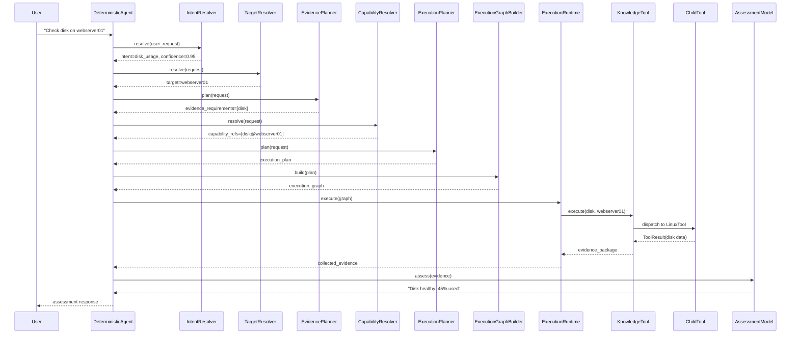
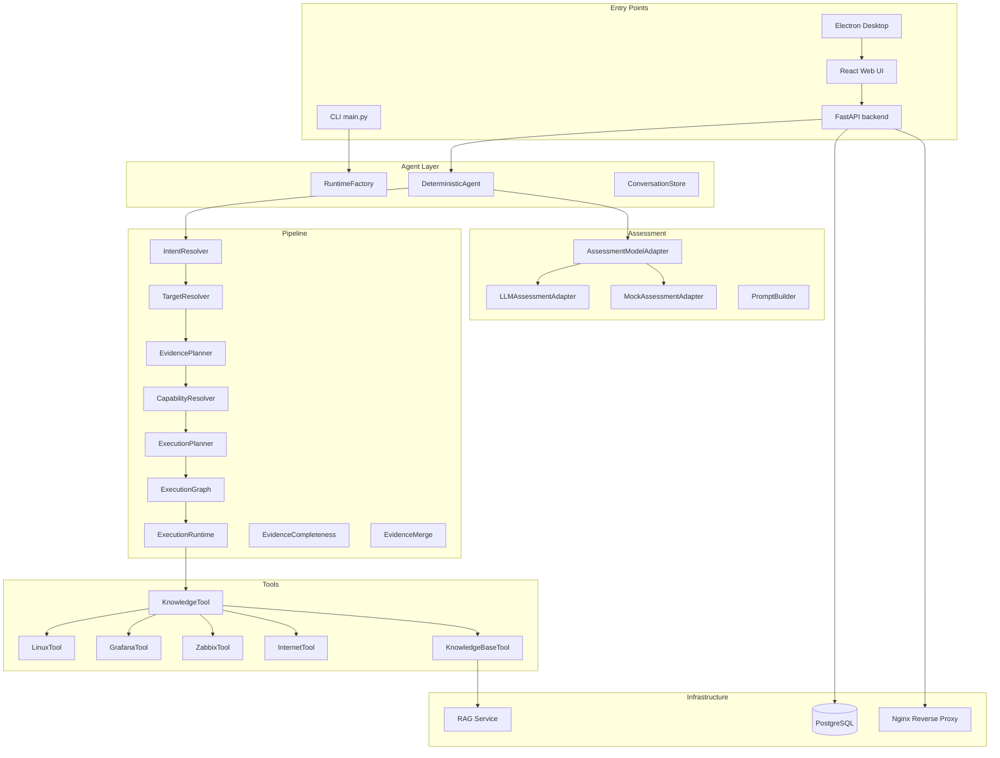
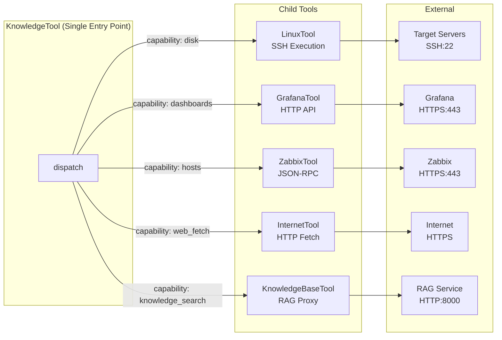
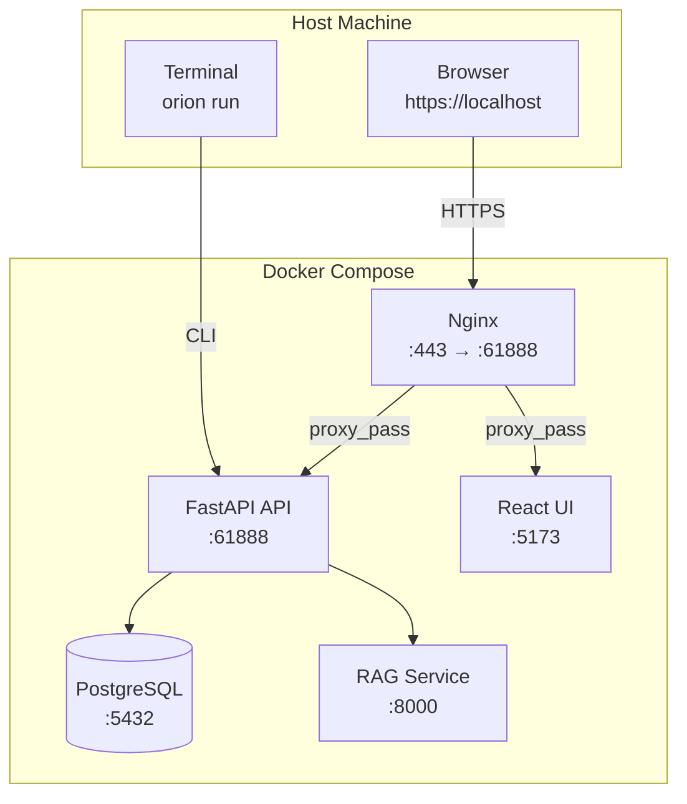
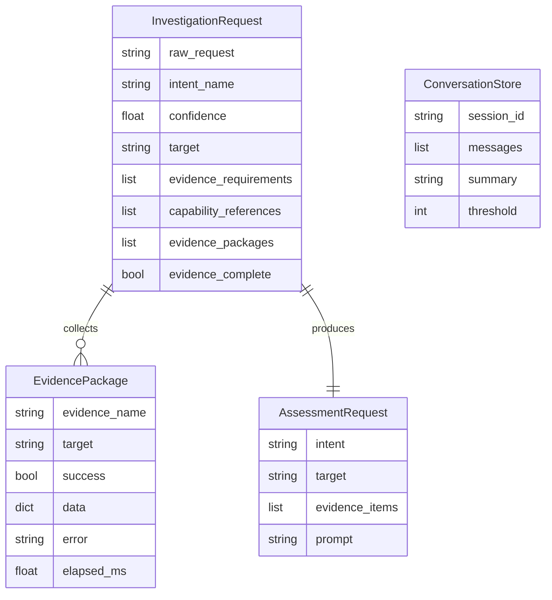

# Architecture Diagrams

> Visual reference for Orion's system architecture and data flows.

---

## Pipeline Execution Flow

---

## Component Architecture

---

## Tool Interaction Diagram

---

## Deployment Architecture (Local Docker Compose)

---

## Data Model

---

> **Last updated:** 2026-07-23