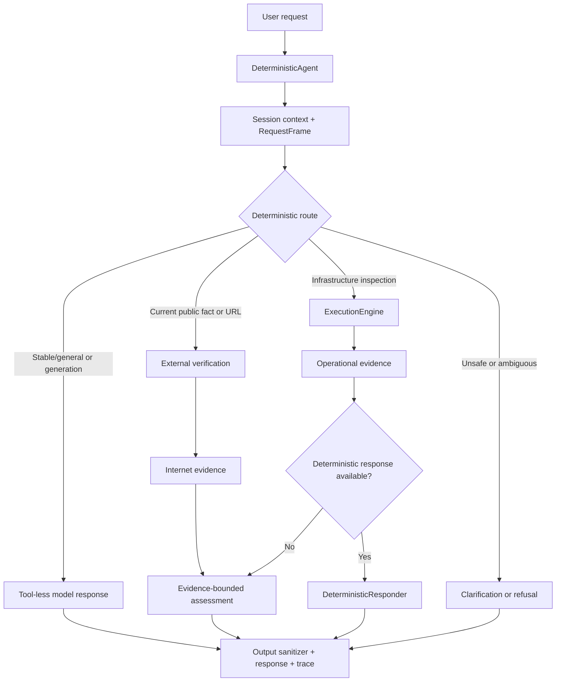
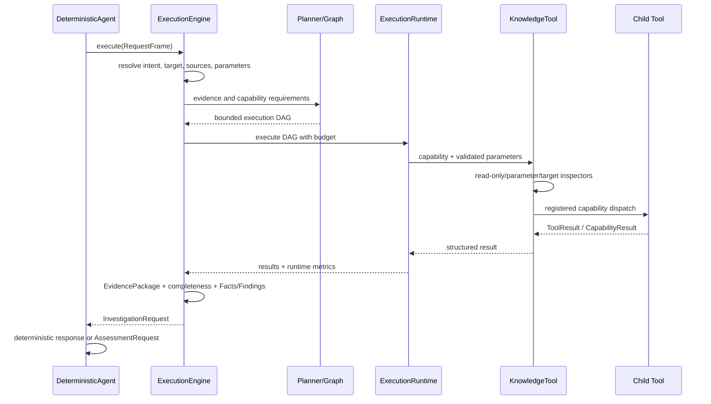
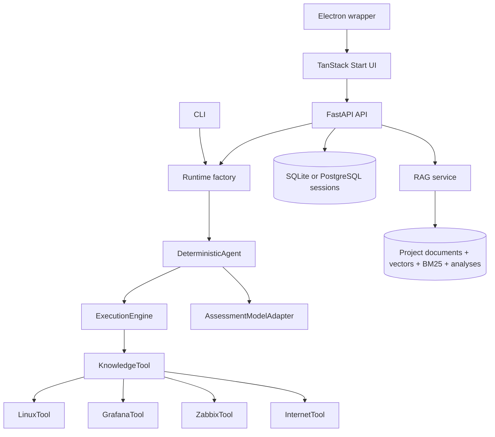
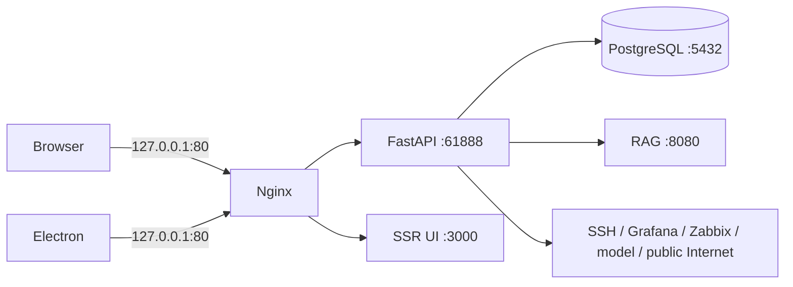
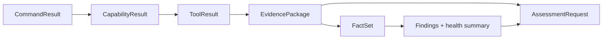

# Architecture Diagrams

These diagrams show the implemented request, component, and deployment flows.

## Request routing

```mermaid
flowchart TD
    U[User request] --> A[DeterministicAgent]
    A --> C[Session context + RequestFrame]
    C --> R{Deterministic route}
    R -->|Stable/general or generation| G[Tool-less model response]
    R -->|Current public fact or URL| EV[External verification]
    R -->|Infrastructure inspection| EE[ExecutionEngine]
    R -->|Unsafe or ambiguous| CR[Clarification or refusal]
    EV --> IE[Internet evidence]
    EE --> OE[Operational evidence]
    IE --> AS[Evidence-bounded assessment]
    OE --> DR{Deterministic response available?}
    DR -->|Yes| RESP[DeterministicResponder]
    DR -->|No| AS
    G --> OUT[Output sanitizer + response + trace]
    AS --> OUT
    RESP --> OUT
    CR --> OUT
```

## Infrastructure investigation

```mermaid
sequenceDiagram
    participant A as DeterministicAgent
    participant E as ExecutionEngine
    participant P as Planner/Graph
    participant R as ExecutionRuntime
    participant K as KnowledgeTool
    participant T as Child Tool

    A->>E: execute(RequestFrame)
    E->>E: resolve intent, target, sources, parameters
    E->>P: evidence and capability requirements
    P-->>E: bounded execution DAG
    E->>R: execute DAG with budget
    R->>K: capability + validated parameters
    K->>K: read-only/parameter/target inspectors
    K->>T: registered capability dispatch
    T-->>K: ToolResult / CapabilityResult
    K-->>R: structured result
    R-->>E: results + runtime metrics
    E->>E: EvidencePackage + completeness + Facts/Findings
    E-->>A: InvestigationRequest
    A->>A: deterministic response or AssessmentRequest
```

## Component architecture

```mermaid
flowchart TB
    CLI[CLI] --> RF[Runtime factory]
    API[FastAPI API] --> RF
    UI[TanStack Start UI] --> API
    DESKTOP[Electron wrapper] --> UI

    RF --> AGENT[DeterministicAgent]
    AGENT --> ENGINE[ExecutionEngine]
    ENGINE --> KT[KnowledgeTool]
    KT --> LT[LinuxTool]
    KT --> GT[GrafanaTool]
    KT --> ZT[ZabbixTool]
    KT --> IT[InternetTool]
    AGENT --> MODEL[AssessmentModelAdapter]

    API --> SESSION[(SQLite or PostgreSQL sessions)]
    API --> RAG[RAG service]
    RAG --> RAGDATA[(Project documents + vectors + BM25 + analyses)]
```

## Local Docker Compose

```mermaid
flowchart LR
    B[Browser] -->|127.0.0.1:80| N[Nginx]
    D[Electron] -->|127.0.0.1:80| N
    N --> API[FastAPI :61888]
    N --> UI[SSR UI :3000]
    API --> PG[(PostgreSQL :5432)]
    API --> RAG[RAG :8080]
    API --> EXT[SSH / Grafana / Zabbix / model / public Internet]
```

Only Nginx and the direct API debug port bind to host loopback. PostgreSQL,
SSR UI, and RAG stay inside the Compose network.

## Evidence contracts

```mermaid
flowchart LR
    CMD[CommandResult] --> CAP[CapabilityResult]
    CAP --> TOOL[ToolResult]
    TOOL --> PKG[EvidencePackage]
    PKG --> FACT[FactSet]
    FACT --> FIND[Findings + health summary]
    PKG --> ASSESS[AssessmentRequest]
    FIND --> ASSESS
```

`VALID` and `VALID_EMPTY` are the only capability states that satisfy required
evidence. Facts and Findings retain source/provenance links.
