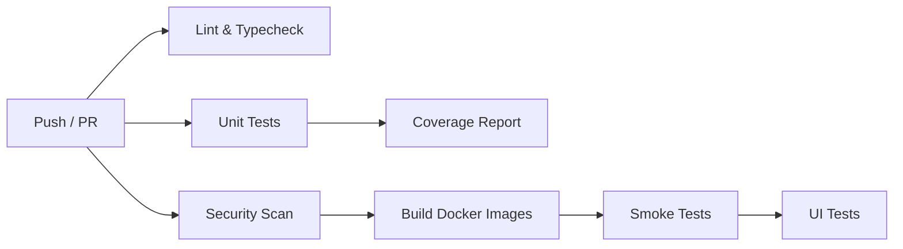

# CI/CD Pipeline

> GitHub Actions CI pipeline structure, jobs, and workflows.

---

## Workflow Overview

The CI pipeline runs on every push and pull request to `main`. It is defined in `.github/workflows/ci.yml`.



---

## Jobs

### 1. Lint & Typecheck

- Runs `ruff check` on all Python source files
- Validates code style, import ordering, and type annotations
- Fast (< 30s), runs first to fail fast

### 2. Unit Tests

- Runs `pytest tests/ -q -x -k "not slow"`
- Uses Python 3.11
- Excludes slow/integration tests for speed
- Targets: ~855 tests, ~24s runtime

### 3. Security Scan

Three tools run in parallel:

| Tool | Scope | Fail Condition |
|------|-------|----------------|
| **Bandit** | Static analysis of `src/` | Any high-severity finding |
| **Safety** | Dependency vulnerability check | CVEs with CVSS ≥ 7.0 (`--audit-level=high`) |
| **pip-audit** | Installed package audit | High-severity CVEs (`--fail-on=high`) |

### 4. Docker Build

- Builds all images: `api`, `ui`, `rag`
- Uses Docker layer caching for speed
- Verifies builds succeed without errors

### 5. Smoke Tests

- Starts Docker Compose services
- Waits for all health checks to pass
- Runs `docker compose exec api pytest tests/test_smoke_containers.py`
- Tears down containers after tests

### 6. UI Tests

- Installs frontend dependencies (`npm ci`)
- Runs Vitest test suite
- Uploads test results as artifacts

---

## Running Locally

```bash
# Run all CI checks
make ci

# Individual steps
bash .workflow/commands/lint.sh
bash .workflow/commands/run-tests.sh
make security-scan
docker compose build
```

---

## Caching Strategy

- **pip cache**: Cached across runs using `actions/cache@v4` with `uv.lock` as key
- **npm cache**: Cached using `actions/setup-node` built-in caching
- **Docker layers**: Cached via Docker BuildKit and GitHub Actions cache backend

---

## Security Scan Configuration

Bandit exclusions in `pyproject.toml`:

```toml
[tool.bandit]
exclude_dirs = [".venv", "tests", "src/tool/RAGTool"]
skips = ["B101", "B104", "B603"]
```

- `B101`: `assert` usage (acceptable in test-like code)
- `B104`: Binding to all interfaces (intentional for local dev)
- `B603`: `subprocess` without `shell=True` (false positive)

---

## Release Workflow

Releases are triggered by pushing a version tag:

```bash
git tag v1.0.0
git push origin v1.0.0
```

This triggers:
1. Full CI pipeline (lint, test, security, build)
2. Docker image tagging with version
3. GitHub Release creation with CHANGELOG

---

> **Last updated:** 2026-07-23